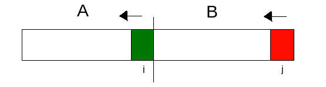
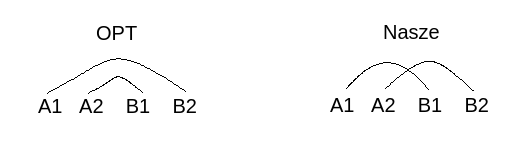
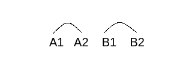

# Lista 1 zadanie 6
## Krystian Grabowski

Pomysł polega na podzieleniu tablicy na dwie równoliczne części(co do jednego elementu). Nazwijmy te części A i B. Następnie ustawiamy dwa wskaźniki. Pierwszy na koniec tablicy A, drugi na koniec tablicy B.
Będziemy porównywać od końca elementy w zbiorze A z elementami w zbiorze B i jeśli zachodzi pożądana zależność, zwiększać ilość elementów które można usunąć.



Zaczynamy więc porównywać elementy znajdujące się na pod indeksami i oraz j w tablicach A oraz B. Jeśli $2*A[i] > B[j]$ to zmniejszamy i, w przeciwnym przypadku usuwamy elementy pod indeksami i w ciągu A oraz j w ciągu B z tablic.


## Poprawność

 Jeśli w naszym algorytmie zachodzi $2*A[i] > B[j]$ to wiemy, że $A[i]$ nie może zostać usunięty przez żaden inny element , gdyż $B[j]$ był elementem największym. Stąd możemy zmniejszyć wartość zmiennej i oraz spróbować porównać B[j] z mniejszymi elementami. Jeśli natomiast $2*A[i] \leq B[j]$ to możemy usunąć te dwa elementy z ciągu. Usuwamy je więc zwiększając liczbę usuniętych elementów o 2.

## Optymalność


Nasze rozwiązanie działa w taki sposób, że usuwa elementy z A2-B2 oraz A1-B1. Załóżmy, że istnieje rozwiązanie optymalne różne od naszego i usuwa ono elementy z A1-B2 i A2-B1.
W optymalnym rozwiązaniu mamy następujące zależności:
$$ 2*A1 \leq B2 $$
$$ 2*A2 \leq B1 $$

Z treści zadania wiemy, że ciąg jest ciągiem niemalejącym więc między zbiorami zachodzą zależności (chodzi o elementy):
$$ A1 \leq A2 \leq B1 \leq B2$$

Stąd:
$$ 2*A2 \leq B1 \leq B2  $$
$$ 2*A2 \leq B2 $$

Oraz:
$$ 2*A1 \leq 2*A2 \leq B1 $$
$$ 2*A1 \leq B1 $$

Rozwiązanie Optymalne może też wyglądać następująco:



Zachodzą w nim własności
$$ 2*A1 \leq A2 $$
$$ 2*B1 \leq B2 $$

Możemy z nich wyprowadzić:
$$ 2*A1 \leq A2 \leq B1 $$
$$ 2*A1 \leq B1 $$

Oraz
$$ 2*A2 \leq 2*B1 \leq B2 $$
$$ 2*A2 \leq B2 $$

Więc jak widać zawsze możemy przekształcić rozwiązanie optymalne do naszego, co przeczy temu że nasze rozwiązanie jest nieoptymalne.

```python
def delmax(array):
    half = len(array) // 2
    a, b = array[:half], array[half:]
    i = len(a) - 1
    j = len(b) - 1
    result = 0
    while (i != -1):
        if (2*a[i] <= b[j]):
            result += 2
            i -= 1
            j -= 1
        else:
            i -= 1
    return result
```

Złożoność czasowa: $O(n)$\
Złożoność pamięciowa: $O(1)$

Złożoność jest liniowa, ponieważ przechodzimy tylko raz przez całą tablicę (wykona się ona co najwyżej n/2 razy). Wskaźniki i oraz j są początkowo wskazują na ostatnie elementy tablic A i B. W każdym kroku zmniejszamy i oraz j lub samo i oraz wykonujemy stałą liczbę operacji (w zasadzie tylko jedno porównanie oraz ewentualne zwiększenie wyniku).

Pamięciowo traktując ciąg jako dane do programu używam jedynie dwóch wskaźników i, j oraz zmiennych na wynik i połowę tablicy, więc koszt stały. 
