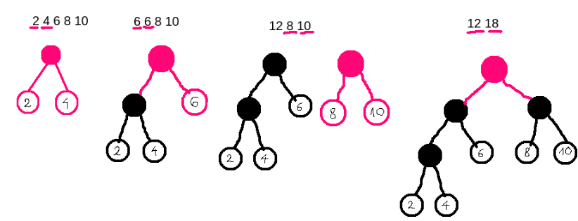

# Lista 2 zadanie 9
## Krystian Grabowski
**Treść**: 
Dla ważonego drzewa $T = (V,E,c)$, gdzie $c:V \rightarrow R_+$, określamy jego zewnętrzną długość $EL(T)$ jako:
$$EL(T)=\sum_{v-liść\in T}{c(v) * d(v)},$$
gdzie $d(v)$ jest długością ścieżki od korzenia do liścia $v$ (mierzoną liczbą krawędzi na ścieżce).\
Rozważmy następujący problem. Dany jest n-elementowy zbiór $\{w_1, ... w_n\}$ dodatnich liczb rzeczywistych. Zadaniem jest znalezienie ważonego drzewa binarnego $T$ o $n$ liściach, takiego, że każda liczba $w_i$ jest wagą dokładnie jednego liścia oraz T ma minimalną wagę $EL(T)$ pośród wszystkich drzew o tej własności.

**Algorytm**\
Tworząc drzewo algorytm będzie umieszczał wierzchołki o większych wagach wyżej, a o mniejszych niżej. W każdym kroku będziemy wybierali dwa wiechołki o najmniejszej wadze i "łączyli je w jeden". Łaczenie polega na polączeniu dwóch wierzchołków (lub w dalszych krokach drzew) w jedno za pomocą dodatkowego wierchołka. Postępując w ten sposób na końcu dostaniemy drzewo binarne



**Optymalność**\
*Lemat 1\
Dla każdego wierzchołka należącego do naszego drzewa nie może istnieć wierzchołek cięższy leżący na niższym poziomie.*

*Dowód* \
Załóżmy, że mamy drzewo $T$, w którym dla jakiegoś wierchołka na poziomach niżej znajduje się wierchołek o większej wadze. Wierzchołek znajdujący się wyżej o mniejszej wadze nazwijmy x, natomiast ten o większej wadze znajdujący się niżej y. Przez S oznaczę sumę wszystkich pozostałych wagi i odległości poza naszymi wierzchołkami x i y. Zewnętrzna dlugość T wyraża się teraz jako:
$$v1 = S + w_x*k_1 + w_y * k_2$$

Gdzie $k_1$ i $k_2$ to odległości d od korzenia. Zamieńmy teraz wierzchołki posiadające wagi $w_x$ i $w_y$ otrzymamy:
$$v2 = S + w_y*k_1 + w_x*k_2$$

Wiemy, że $k_2 = k_1 + c$, po odjęciu $S$ zniknie całkowicie więc pomijam.
$$v1 - v2 = (w_x*k_1 + w_y*(k_1 + c)) - ( w_y*k_1 + w_x*(k_1 + c)) =$$
$$= (w_x*k_1 + w_y*k_1 + w_y*c) - ( w_y*k_1 + w_x*k_1 + w_x*c) =$$
$$= w_x*k_1 + w_y*k_1 + w_y*c - w_y*k_1 - w_x*k_1 - w_x*c =$$
$$= w_y*c  - w_x*c > 0$$

Więc po zamianie wierzchołka o większej wadze z tym o mniejszej otrzymaliśmy drzewo, którego całkowity koszt jest mniejszy.

*Twierdzenie 1\
Nasz algorytm buduje drzewo binarne o minimalnej długości zewnętrznej*

*Dowód*\
Udowodnimy twierdzenie stosując indukcję po liczności zbioru $\{w_1, ... w_n\}$ nazwijmy ją $n$.

* Podstawa indukcji $n = 2$ \
Takie minimalne drzewo możemy skonstruować tylko w jeden sposób (posiadając jakiekolwiek inne wierzchołki można je usunąc i w ten sposób otrzymać drzewo o mniejszym koszcie). Będzie to korzeń z lewym oraz prawym synem. Nasz algorytm weźmie dwa dostępne wierzchołki i skonstruuje takie wlaśnie drzewo.
* Krok indukcyjny\
Załóżmy, że każde drzewo o $n-1$ liściach zbudowane przez nasz algorytm ma minimalną długość zewnętrzną. Weźmy drzewo o $n$ liściach zbudowane przez nasz algorytm. Niech $v_1 \leq v_2 ... \leq v_n$ będą wagami liści tego drzewa. Niech $V$ oznacza rodzica $v_1$ i $v_2$. Wiemy na podstawie tego jak budujemy drzewo, że te liście będą leżeć na ostatnim poziomie drzewa. Jeśli jakikolwiek liść leżałby niżej z lematu 1 moglibyśmy zamienić go z $v_1$ albo $v_2$ i otrzymać drzewo o mniejszej długosci zewnętrznej. Niech $T'$ będzie drzewem T z tą różnicą, że wierzchołek V zastępujemy liściem $V'$, którego waga to $v_1 + v_2$. Możemy wykonać taką operację, ponieważ algorytm łączy drzewa licząc ich sumaryczną wagę, więc zamiana drzewa na jeden wierzchołek niczego nie zmieni. $T'$ jest drzewem o $n-1$ liściach, więc z założenia indukcyjnego ma minimalną długość zewnętrzną. Przywracając dzieci do $V'$ otrzymamy $T$, które będzie mialo minimalną długość zewnętrzną. Dwa najmniejsze wierzchołki z lematu 1 nie mogą leżeć nigdzie wyżej, stąd otrzymane drzewo musi być optymalne.

**Poprawność**\
Najmniejsze wagowo liście muszą znajdować się nie wyżej niż wszystkie inne dostępne w danej iteracji. Budujemy drzewa od dołu. Łącząc dwa najmniejsze wagowo drzewa/wierzchołki zapewniamy, że znajdą sie one nie wyżej niż pozostałe(Lemat 1). Gdyby tak nie było, to znaczyłoby, że jakieś inne dwa drzewa musiałyby być użyte do stworzenia drzewa wyższego o 1 od naszego(złożonego z minimów), a później połączone z naszym (abyśmy nie znajdowali się na samym dole z tymi najmniejszymi). Jest to niemożliwe, ponieważ wagi naszych wierzchołków są najmniejsze, stąd też ich suma jest najmniejsza z dostępnych sum. Można też traktować budowanie drzewa jako zwijanie listy do 1 elementu, a później rozwijanie. Stąd pierwsze złączone wierzchołki będą ostatnimi rozwiniętymi na dole). W każdym kolejnym kroku łaczymy dwa wierzchołki lub drzewa i przedstawiamy je jako jedno. Stąd po $n-1$ iteracjach dostaniemy binarne drzewo, ktorego liście zawierają wszystkie dostępne wagi $w_i$. Wagi każdego z początkowych liści nie ulegną zmianie. Na koniec wszystkie liście w drzwie będą miały przyporządkowane odpowiednie wagi (najwyższe na górze bo złączone najpóźniej a najmniejsze najniżej bo złączone najwcześniej).

**Pseudokod**
```c++

struct node {
    int value;
    node left;
    node right;
}

node el(T) { // T to vector struktur node początkowo każdy to wierzchołek z value oraz nullami na left i right.
    build-heap(T) // kluczem jest wartość value
    for (int i=0; i<n-1; i++) {
        v1 = extract_min(T)
        v2 = extract_min(T)
        node v;
        v.left = v1;
        v.right = v2;
        v.value = v1.value + v2.value;
        T.insert(v);
        restore_order(T, T.size()-1);
    }
    return T[0];
}
 


```
**Złożoność**\
Czasowa: $O(nlogn)$\
Pamięciowa: $O(n)$

Budujemy kopiec w czasie liniowym $O(n)$. Następnie mamy pętlę wykonującą się $n-1$ razy. W każdej wykonujemy po dwie operacje extract_min, które zwracają oraz usuwają element o minimalnym value z kopca. Wiemy, że każde wywołanie funkcji extract_min zajmie $O(lgn)$ czasu. Następnie wykonujemy pewną stałą liczbę operacji i na koniec wstawiamy nowy element do kopca. Samo wstawienie wykonamy w czasie stałym jednak przywracanie porządku to znów $O(lgn)$. Dodając wszystko nie przekroczymy $O(nlogn)$ operacji.

Pamieciowo musimy pamiętać nasz kopiec T co wymaga liniowo wiele pamięci. W każdym kroku pętli tworzymy nowy węzeł. Musimy więc zapamiętać dodatkowo nową wartość value, wskaźnik na lewe i prawe poddrzewo. Finalnie pamięć nadal będzie liniowa, gdyż co iteracje dodajemy stałą liczbę nowych wartości.