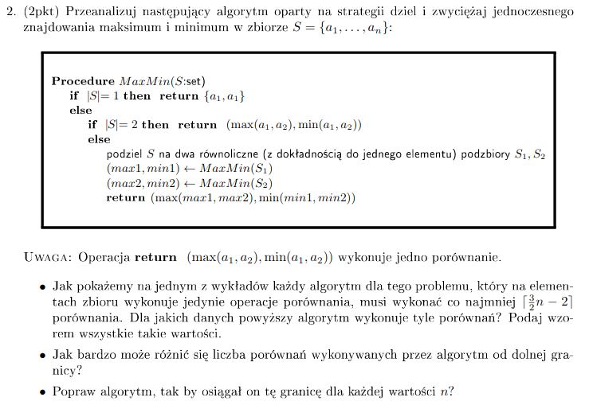
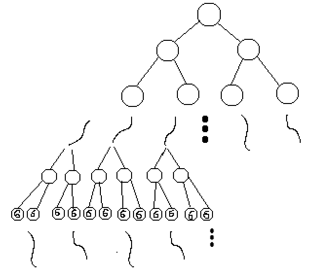

# Lista 3 zadanie 2
## Krystian Grabowski
**Treść**: 


**Dla jakich wartości się psuje?**\
*Lemat 1*\
Algorytm wykonuje założoną liczbę porównań dla wartości $2^{k}-1, 2^{k}, 2^{k}+1$.

*Dowód indukcyjny Lematu 1*
* Podstawa\
    Dla $k=0$ otrzymamy wartości 0, 1 oraz 2. Dla 0 algorytm wykona 0 porównań. Dla 1 algorytm wykona również 0 porównań. Dla 2 natomiast wykona 1 porówanie. Stąd podstawa indukcji spełniona.
* Krok\
    Załóżmy, że dla każdego $k-1$ lemat 1 jest prawdziwy. Zobaczmy co się dzieje dla wartości k. Rozpatrując zbiór o liczności $2^k$ wiemy, że algorytm podzieli go na dwa równoliczne(z dokładnością co do jednego) podzbiory. Stąd zbiory liczące $2^k$ elementów podzielimy na dwa zbiory liczące $2^{k-1}$ elementów. Z założenia indukcyjnego algorytm wykona zakładaną liczbę porównań dla tych zbiorów. Podobnie będzie w przypadku $2^{k}-1$ oraz $2^{k}+1$. Podczas dzielenia $2^{k} - 1$ na podzbiory otrzymamy podzbiór o wielkości $2^{k-1}$ oraz $2^{k-1}-1$. A podczas dzielenia $2^{k}+1$ zbiory o liczności $2^{k-1}+1$ i $2^{k-1}$. Dla obydwu przypadków z założenia indukcyjnego możemy stwierdzić, że algorytm wykona dla nich założoną liczbę porównań.
    Podsumowując dla:
    
    Dla $2^{k}$
    $$2*\lceil\frac{3}{2} * 2^{k-1} - 2\rceil + 2 = $$
    $2^{k-1}$ parzyste więc możemy usunąć sufit, bo $(3 * parzysta)$ podzieli się przez 2 bez reszty.
    $$\frac{3}{2} * 2^{k} - 4 + 2 = $$
    $$\frac{3}{2} * 2^{k} - 2 $$
    
    Dla $2^{k}-1$
    $$\lceil\frac{3}{2} * (2^{k-1} -1) - 2\rceil + \lceil\frac{3}{2} * 2^{k-1} - 2\rceil + 2 = $$
    $$\lceil\frac{3}{2} * 2^{k-1} -3\frac{1}{2}\rceil + \frac{3}{2} * 2^{k-1} = $$
    $$\frac{3}{2} * 2^{k-1} + \frac{3}{2} * 2^{k-1} - 3 = $$
    $$\frac{3}{2} * 2^{k} - 3$$

    Dla $2^{k}+1$
    $$\lceil\frac{3}{2} * (2^{k-1} + 1) - 2\rceil + \lceil\frac{3}{2} * 2^{k-1} - 2\rceil + 2 = $$
    $$\lceil\frac{3}{2} * 2^{k-1} -\frac{1}{2}\rceil + \frac{3}{2} * 2^{k-1} = $$
    $$\frac{3}{2} * 2^{k-1} + \frac{3}{2} * 2^{k-1} = $$
    $$\frac{3}{2} * 2^{k}$$

Jeśli wiemy, że dla potęg $k-1$ osiągamy oczekiwaną liczbę porównań to jak widać w powyższych równaniach dla $2^{k}$(+-1) otrzymamy po scaleniu takie wartości jakie powinniśmy otrzymać według wzoru, czyli $\lceil\frac{3}{2}n -2\rceil$.

Algorytm nie wykonuje założonej liczby porównań jeśli liczność naszego zbioru jest różna od $2^{k}-1, 2^{k}, 2^{k}+1$, wtedy nasz algorytm wykona więcej porównań. Niech n będzie licznością zbioru. Gdy n jest liczbą parzystą różną od potęg 2, to w binarnej reprezentacji musi mieć conajmniej dwie jedynki (jedną przy pierwszym $2^k \leq n$, a drugą na mniej znaczącym bicie). Stąd, przy dzieleniu przez 2, które jest przesuwaniem binarnej reprezentacji w prawo, otrzymamy w którymś kroku dwa zbiory o nieparzystej liczbie elementów. W takiej sytuacji możemy oszacować koszt znalezienia min i max dla tych dwóch zbiorów.

Przypadek 1\
$( n-parzyste, \frac{n}{2}-nieparzyste)$
$$2*\lceil\frac{3}{2}*\frac{n}{2} - 2\rceil + 2 =$$
Wiemy, że $\frac{n}{2}$ jest nieparzyste, stąd też pomnożone przez $\frac{3}{2}$ da nam ułamek, który zostanie zaokrąglony w górę (dokładnie dodamy $\frac{1}{2}$). Stąd możemy odrazu dodać $\frac{1}{2}$ 
$$2*(\frac{3}{2}*\frac{n}{2} - 1.5) + 2 =$$ 
$$\frac{3}{2}*n - 3 + 2 =$$
$$\frac{3}{2}*n - 1$$

Więc jak widać w przypadku parzystej liczby nie będącej potędą dwójki wykonamy conajmniej 1 porównanie więcej. Do rozpatrzenia mamy jeszcze drugi przypadek, gdy n jest nieparzyste.

Przypadek 2\
$( n-nieparzyste)$\
W tym przypadku dzieląc zbiór o nieparzystej liczbie elementów otrzymamy dwa podzbiory. Jeden o liczności parzystej, drugi nieparzystej. Tu również możemy spojrzeć na binarną reprezentację naszego n. Skoro jest nieparzyste to na najmniej znaczącym bicie ma 1. Wiemy, że nie jest to $2^{k}+1$ stąd oprócz najmniej znaczącego bitu oraz tego o największej wadze musi być zapalony jeszcze conajmniej jeden inny. Możemy z tego wywnioskować, że otrzymany zbiór parzysty nie jest potęgą dwójki(+-1), a w takim wypadku przy liczeniu min i max dla niego wykonamy minimum jedno porównanie więcej. Dodatkowo wywołamy się rekurencyjnie znów na zbiorze nieparzystym co w dalszych krokach wygrenruje dodatkowe porównania. Dlatego też w przypadku 2 również nie możemy liczyć na założoną liczbę porównań.

**Ile więcej porównań może wykonać przedstawiony algorytm?**\
Rozpiszę kilka początkowych wartości n. Określę jaką powinny osiągać ilość porównań oraz jaką mają w rzeczywistości.

*Tabelka 1.1*
| n | Oczekiwana | Rzeczywista
| - |:----------:| :---------:|
| 1 | 0| 0|
| 2 | 1| 1|
| 3 | 3| 3|
| 4 | 4| 4|
| 5 | 6| 6|
| 6 | 7| 8|

Jak widać wartość 6 jest pierwszą wartośćią przy której zakładana liczba porównań nie zgadza się z rzeczywistą. Możemy przedstawić działanie naszego algorytmu jako drzewo binarne. W drzewie tym na pewnym poziomie mamy same 6, czyli najmniejszy przypadek dla którego otrzymujemy niepoprawną liczbę porównań.


Rysunek 1.1

Taki przypadek(6) podzieli się jeszcze na dwa zbiory 3 elementowe oraz na 1 i 2 elementowe. Podczas każdego wywołania algorytmu dla wartości 6(zbiór liczności 6) dodamy pewną nadmiarową liczbę porównań. Od jakiej wartości musimy zacząć, aby otrzymać drzewo przedstawione na rysunku? Wiemy, że w każdym kroku dzielimy zbiór na dwa równoliczne zbiory. Stąd, aby otrzymać $2^k$ szóstek nasze $n$ musi być równe $2^k * 6$. W każdym kroku podziału podzielimy nasze n przez 2, aż zostaną same wartości 6 i będzie ich $2^k$. Czyli patrząc względem n wywołamy się $\frac{n}{6}$ razy na zbiorach o liczności 6 i jak wiemy z *Tabelka 1.1* w każdym takim wywołaniu wykonamy jedno nadmiarowe porówanie. Stąd widać, że dla takiego przypadku jest co najmniej $\frac{n}{6}$ więcej porównań. Z drugiej strony jeśli istniałby jakikolwiek inny przykład, który generuje większą liczbę porównań, to wiemy że porównań nie może być nigdy więcej niż węzłów w drzewie. Liczba węzłów w takim drzewie wyraża się następującym wzorem:
$$\sum^{log_2 n}_{i=0} 2^i = 2^{log_2n + 1} - 1 < 2n $$ 

Na każdym z poziomów, których jest logarytmicznie wiele dodajemy $2^i$ wierzchołków. Patrząc binarnie wstawiamy jedynki od 0 do $log_n$ pozycji co jest równe $2^{log_2n + 1} - 1$, a to będzie zawsze mniejsze od $2n$. Chociażby dlatego, że nasze n pomnożone razy dwa przesunie się binarnie w lewo o 1 i będzie miało jedynkę na pozycji $log_2n+1$, a $2^{log_2n + 1} - 1$ pierwszą jedynkę będzie miało na pozycji $log_2n+1$ (patrząc od najmniej znaczącego bitu). Finalnie takich dodatkowych porównań będzie maksymalnie liniowo wiele.


**Poprawa algorytmu**\
Algorym, który zaproponuję wykorzystuje spostrzeżenia z punktu 1. Algorym psuł się gdy:
* dzieliliśmy zbiór o parzystej liczbie elementów na dwa równoliczne zbiory o nieparzystej liczbie elementów.
* dzieliliśmy zbiór o nieparzystej liczbie elementów na dwa zbiory równoliczne co do jednego elementu (jeden parzysty drugi nieparzysty).

Wprowadzając następujące poprawki:
* Gdy n, w danym kroku jest parzyste a po podzieleniu na dwa zbiory równoliczne owe zbiory mają nieparzystą liczbę elementów, to przenosimy jeden z elementów do drugiego zbioru. W ten sposób otrzymamy dwa zbiory o parzystej liczbie elementów.
* Gdy n jest nieparzyste możemy oddzielić jeden element ze zbioru i wywołać sie na zbiorze o parzystej liczbie elementów. Jak pokażę poniżej nie wpłynie to na założoną liczbę porównań.
* w pozostałych przypadkach działamy tak samo jak w algorytmie przedstawionym w treści zadania.

Indunkcyjny dowód wykonywania założonej liczby porównań poniżej
* Podstawa\
Za podstawę może posłużyć tabelka podobna do *tabelka 1.1*, w której są rozpisane pierwsze przypadki.

    | n | Oczekiwana | Rzeczywista
    | - |:----------:| :---------:|
    | 1 | 0| 0|
    | 2 | 1| 1|
    | 3 | 3| 3|
    | 4 | 4| 4|
    | 5 | 6| 6|
    | 6 | 7| 7|
    Więc jak widać podstawa indukcji jest spełniona.

* Krok indukcyjny\
W kroku indukcyjnym musimy rozpatrzeć 3 przypadki:
  * ($n$-parzyste ,$\frac{n}{2}$ - nieparzyste)
    $$T(n) = T(\frac{n+2}{2}) + T(\frac{n-2}{2}) + 2=$$
    $$\lceil\frac{3*(n+2)}{4} - 2\rceil + \lceil\frac{3*(n-2)}{4} - 2\rceil + 2=$$
    $n$ jest liczbą podzielną przez 2, a $\frac{n}{2}$ już nie jest. Skoro tak to $\frac{n+-2}{2}$ będzie już parzyste i podzieli się bez reszty przez 4. Stąd usuwam sufit.
    $$\frac{3*(n+2)}{4} + \frac{3*(n-2)}{4} - 2=$$
    $$\frac{3n+6}{4} + \frac{3n-6}{4} - 2=$$
    $$\frac{6n}{4} - 2= \frac{3}{2}n-2$$

  * ($n$-nieparzyste)
    $$T(n) = T(n-1) + T(1) + 2=$$
    $$\lceil\frac{3(n-1)}{2} - 2\rceil + 0 + 2=$$
    Skoro $n$ nieparzyste to $n-1$ parzyste i $3(n-1)$ będzie podzielne przez 2 bez reszty(np * p), stąd usuwam sufit.
    $$\frac{3(n-1)}{2}=$$
    $$\frac{3}{2}n-\frac{3}{2}$$
    Wiemy, że 3 razy liczba nieparzysta, będzie liczbą nieparzystą, czyli niepodzielną przez 2. Jeśli odejmiemy $\frac{3}{2}$ to otrzymamy liczbę całkowitą. Stąd odjęcie od niej $\frac{1}{2}$ i wzięcie sufitu z całości nie zmieni wyniku więc finalnie mogę zapisać:
    $$\lceil\frac{3}{2}n-2\rceil$$

  * ($n$-parzyste ,$\frac{n}{2}$ - parzyste)
    $$T(n) = 2*T(\frac{n}{2}) + 2 =$$ 
    $$2*\lceil\frac{3n}{4} - 2\rceil + 2 =$$
    $\frac{3n}{4}$ będzie podzielne bez reszty przez 4, stąd usuwam sufit.
    $$\frac{3n}{2} - 2$$


```python
def MaxMin2(S:set)
    if len(S) == 1: return (S[0], S[0])
    if len(S) == 2: return (max(S[0], S[1]), min(S[0], S[1]))
    else: 
        if n % 2 == 1:
            S1 = pierwszy element z S
            S2 = pozostałe elementy z S
        if n % 2 == 0 and (n / 2) % 2 == 0:
            S1 = połowa elementów z S
            S2 = druga połowa elementów z S
        if n % 2 == 0 and (n / 2) % 2 == 1:
            S1 = połowa elementów z S oraz element (n/2+1)
            S2 = pozostałe elementy z S
        (s1Max, s1Min) = MinMax2(S1)
        (s2Max, s2Min) = MinMax2(S2)
        return (max(s1Max, s2Max), min(s1Min, s2Min))

```


